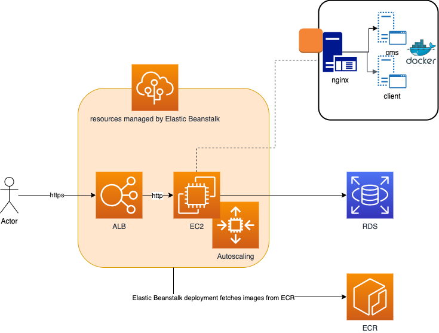

# Architecture

This solution is based on the following architecture:

The solution is composed of the following components:
- cms: a headless Strapi CMS that provides a REST API to manage the content of the website
- client: a Next.js application that consumes the CMS API and renders the website

Both are deployed on AWS using the following services:
- ECR: to store the Docker images
- Elastic Beanstalk: to deploy the Docker images using a multi-container Docker environment
- EC2: to host the Docker images (managed by Elastic Beanstalk)
- ALB: to route the traffic to the EC2 instances and provide SSL termination
- RDS: to host the database

Other AWS services are used internally by Elastic Beanstalk, for example:
- Autocaling: to scale the EC2 instances
- S3: to store the logs

# Deployment

The deployment is automated using a GH Action that builds the Docker images and deploys them to Elastic Beanstalk.

# Infrastructure as Code

The resources required to deploy the solution are defined in the `infrastructure` folder. The infrastructure is defined using Terraform.

There are two Terraform projects in the `infrastructure` folder:
- state: to store the Terraform remote state in an S3 bucket
- base: to deploy the infrastructure, using the remote state stored in the S3 bucket

The `state` project must be deployed first, and then the `base` project can be deployed.

# Elastic Beanstalk customisation

Customisation of the Elastic Beanstalk environment is done partly at the point of provisioning. For example, the instance types of the EC2 and RDS instances.

However, it is also possible to customise the environment after it has been provisioned. For example, the environment variables of the EC2 instances, nginx configurations.

The customisation options for Amazon Linux 2 platform can be found here:
https://docs.aws.amazon.com/elasticbeanstalk/latest/dg/platforms-linux-extend.html

We're using the following customisation options, using the ".platform" folder:
- .platform/nginx/conf.d/platform.conf: to configure nginx to proxy the requests to the CMS and client applications
- .ebextensions/authorized_keys.config: to add public SSH keys to the EC2 instances
